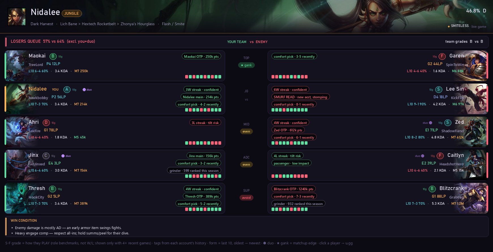
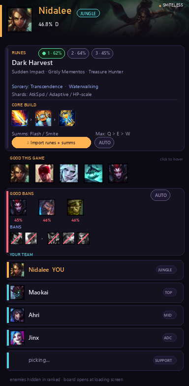
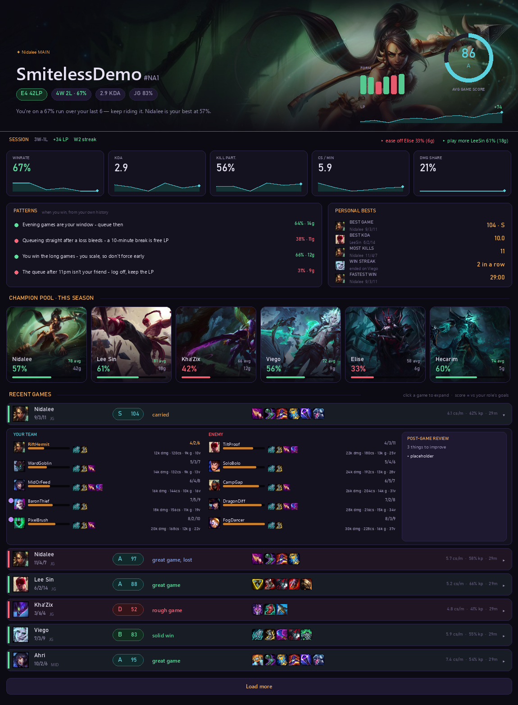

# Smiteless ⚔️

**A League of Legends companion that plays the map with you.** It watches champ select and your live game, then tells you the one thing that matters right now — what to ban, when to back, whether that drake fight is winnable, and when to stop queuing.



| Champ select (docks by the client) | Your profile |
|:---:|:---:|
|  |  |

> ⚠️ **Small personal project — Windows + NA only, no warranty.** Not affiliated with or endorsed by Riot Games; respect the [Riot API terms](https://developer.riotgames.com/policies/general). The player scout needs your own free Riot API key.

## ⬇️ Install

**[Download SmitelessSetup.exe](https://github.com/bobbyroylee/smiteless/releases/latest)** → double-click → Install. No Python, no setup — everything's bundled. Windows 10/11, League in **Borderless** mode. Full walkthrough (including the free Riot-key setup): **[INSTALL.md](INSTALL.md)**.

It lives in your tray (gold **S**), opens itself at champ select and in-game, and keeps itself updated. Hotkeys: **Ctrl+Alt+X** overlay · **Ctrl+Alt+B** widget.

## What it does

### 🧠 In champ select
- **Scouts everyone live** — rank, form, player grades (S–F from how they actually *play*), duo detection, and a **dodge read** that flags tilted or struggling teammates *while you can still dodge*
- **Smart bans** — ranked by who threatens your whole team's hovers, weighted by pick rate, with optional **auto-ban** that waits until the last seconds for maximum hover intel
- **Real matchup tips** — written by actual guide authors for your exact matchup, not AI
- **One-click (or automatic) runes + summoners import**, multiple rune sets, favourite picks
- **Climb guards** — warns when you hover a champ you barely play (sub-12k-mastery picks win ~44%, per a 1M-game study), and only suggests champs you actually main — pooled across all your accounts

### ⚡ In game
- **The Tempo engine** — a live director for the ~90 seconds before every objective: your farm window, exact recall deadline, when to rotate, and a **TAKE / GIVE / 50-50 verdict** from death timers, levels and gold (fog-of-war aware). With spoken callouts: *"Base now"*, *"Rotate to dragon"*, *"Give it, trade elsewhere"*
- **Enemy jungle tracker** — where they were seen, when they're dead, when to respect the gank
- **Win probability, objective timers with audio, power-spike alerts, item coaching** — one compact draggable HUD that fades when nothing needs you

### 📈 Between games
- **Your profile** — per-game performance scores graded against your role's benchmarks (never the lobby), timeline review of your latest game, LP trend, session tracking
- **The climb system** — research-backed discipline: the 2-loss stop rule, champion-pool focus, and sample-aware "play more / ease off" coaching
- **Click any player** to scout their full profile; right-click for u.gg / op.gg / Porofessor
- **One-click Riot login** — save each account's "Stay signed in" session once, then switch accounts straight from the tray: no passwords stored, sessions DPAPI-encrypted, League relaunches already logged in

Patch notes: tray → **Patch notes**, or [CHANGELOG.md](CHANGELOG.md).

## 🛠️ Building from source

```
git clone https://github.com/bobbyroylee/smiteless
pip install pillow pystray
python smiteless_main.py overlay      # or: widget / settings / profile
```

`dist\build.ps1` builds the frozen app; `dist\make-release.ps1 -Version X.Y.Z` cuts a release (PyInstaller + AHK-compiled tray/installer, Python 3.11+).
