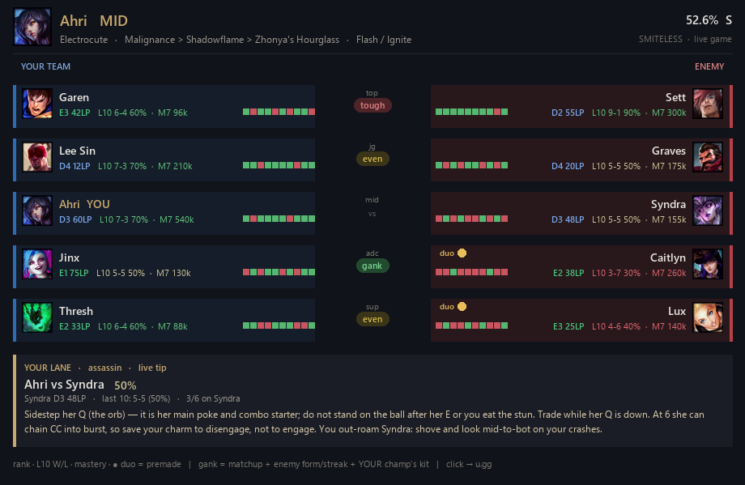

# Smiteless

A League of Legends champ-select & in-game companion. It opens a **scoreboard-style
overlay** (rendered as an image) that shows everything you want before and during a
game — and it auto-opens when a match starts.



The overlay has:

1. **Build / runes header** — keystone, core items, summoners, and your champ's win
   rate/tier, live from op.gg.
2. **Both teams aligned by role** — each lane is `your champ` vs the **real enemy in
   that role**, read straight from the live game (paired by slot, never inferred).
3. **Gank rating per enemy lane** — a transparent weighted score (no AI): your lane's
   matchup edge + the enemy laner's recent form + their win rate on the champ they're
   playing. Starts as the matchup, then shifts as the live scout loads (a tilted /
   off-role enemy becomes a clear gank).
4. **Per-player form bar** — each player's last-10 W/L from the Riot API (the "are they
   on a heater / tilted" read). Always current, unlike cached profile sites.
5. **Lane panel** — when you lock a **lane** (not jungle), a panel with your matchup, the
   opponent's recent form, and a **specific, current matchup tip** ("dodge her E, hold Wind
   Wall for her R, all-in at 6…"). Tips are generated once per patch by the LLM **with web
   search** (so they're up to date, not stale recall) and cached to disk — instant every
   game after, and the cache files are plain text you can hand-edit. Before a tip is cached
   it falls back to an archetype-based macro line.

Everything that states a number traces to a real source (op.gg or the Riot API).

## Behavior

- **Auto-opens** when a match starts (loading screen onward) — no need to press anything.
- **Win+B** reopens it after you close it.
- **Second monitor** — opens on your secondary display if you have one.
- Run League in **Borderless** so the overlay renders over the game (fullscreen-exclusive
  hides all overlays — same requirement as Blitz/Porofessor).

## The gank score (transparent, tunable)

```
score =  1.0 * (your_lane_winrate - 50)      # matchup edge
       + 0.5 * (50 - enemy_last10_winrate)   # enemy form (a 10-loss streak = +25)
       + 0.3 * (50 - enemy_champ_winrate)    # enemy comfort on this champ (>=3 games)
       + 5.0  if the enemy is off their champ
score >= +6  -> gank      |  score <= -6  -> tough  |  else even
```

Weights/threshold live at the top of `smitecard.py` (`GANK_W_*`, `GANK_T`).

## Requirements

- **Python 3** + **Pillow** (`pip install -r requirements.txt`). The rest is standard library.
- **AutoHotkey v2** — for `smiteless.ahk` (hotkey, auto-open, monitor placement).
- **Riot API key** (for the player scout) — put it in `~/.riot_api_key`. Dev keys expire
  every 24h; a free production key lifts the rate limit and never expires.

## Setup

1. Clone, then `pip install -r requirements.txt`.
2. Edit `smiteless.ahk` — set `PY` to your `python.exe` (or leave `"python"`).
3. (Optional) Save your Riot API key to `~/.riot_api_key` for the player scout.
4. Run `smiteless.ahk`. It auto-opens on game start; Win+B reopens.

Render a card standalone (writes a PNG): `python smitecard.py --out card.png`

## Components

- `lolgame.py` — resolves the current game (your champ/role + both teams **with roles**)
  from whichever source is live: champ-select session -> Live Client API -> gameflow.
- `lolbuild.py` — op.gg build card + cached Data Dragon decode (champ names, icons, items).
- `lolcoach.py` — verified per-lane op.gg win rates, **paired strictly by role slot**.
- `lolscout.py` — Riot API per-player recent form (last-10 W/L + current-champ record),
  rate-limit aware, permanent match caching.
- `lolmatchup.py` — per-matchup lane tips: generated once per patch via `claude` with web
  search (current, not stale), cached to `~/.claude/cache/matchups/` as editable text.
- `smitecard.py` — composites the scoreboard PNG; renders progressively and waits for the
  match to come up so auto-open works from the loading screen.

## Notes & roadmap

- **In-game only** for the full board — roles + player scout require the live game (the
  loading screen only exposes placeholder IDs). Pre-game it shows your build + a heads-up.
- **Rate limits:** with a dev key the 10-player scout is ~110 calls ≈ ~2 min cold, then
  instant from cache. A production key makes it fast.
- Config points still hardcoded for the author's setup (League drive, Python path, NA
  region) — moving these to a config file is on the list.
